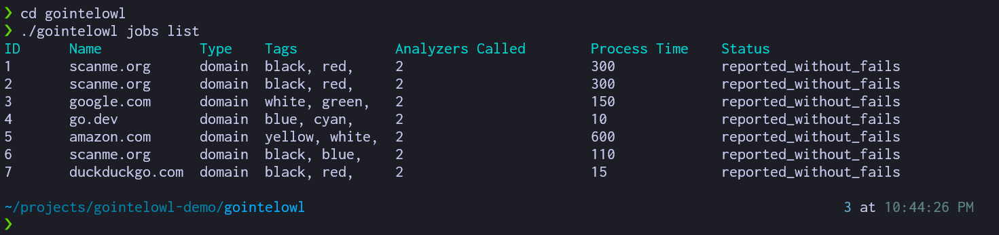

# go-intelowl

This is a miniature version of the `go-intelowl` client.

## Usage

To get started, clone the repository:

```
git clone https://github.com/burntcarrot/go-intelowl
```

Start the mock server:

- Run through source:
	```
	cd mockserver
	go run server.go
	```

- Run by using the pre-built binary:
	```
	cd mockserver
	./server
	```

Run the `gointelowl` CLI:

- Run through source:
	```
	cd gointelowl
	go run cmd/gointelowl/main.go
	```

- Run by using the pre-built binary:
	```
	cd gointelowl
	./gointelowl
	```

## Commands

The mock CLI implements the functionality of listing out jobs for now as a demo.

The data has been imported from IntelOwl's Redoc documentation for the jobs endpoint (`/api/jobs`).

**To view all the jobs, use:**

```
./gointelowl jobs list
```

Example output:

```
❯ ./gointelowl jobs list
ID      Name            Type    Tags            Analyzers Called        Process Time    Status
1       scanme.org      domain  black, red,     2                       300             reported_without_fails
2       scanme.org      domain  black, red,     2                       300             reported_without_fails
3       google.com      domain  white, green,   2                       150             reported_without_fails
4       go.dev          domain  blue, cyan,     2                       10              reported_without_fails
5       amazon.com      domain  yellow, white,  2                       600             reported_without_fails
6       scanme.org      domain  black, blue,    2                       110             reported_without_fails
7       duckduckgo.com  domain  black, red,     2                       15              reported_without_fails
```



## SDK

The SDK is implemented in the `internal` package. The `client.go` supports the creation of new clients, helper functions, etc.

## CLI

The CLI is implemented in the `command` package. All commands are defined under this package, and subcommands are defined in their own package, making the code structure much cleaner.
